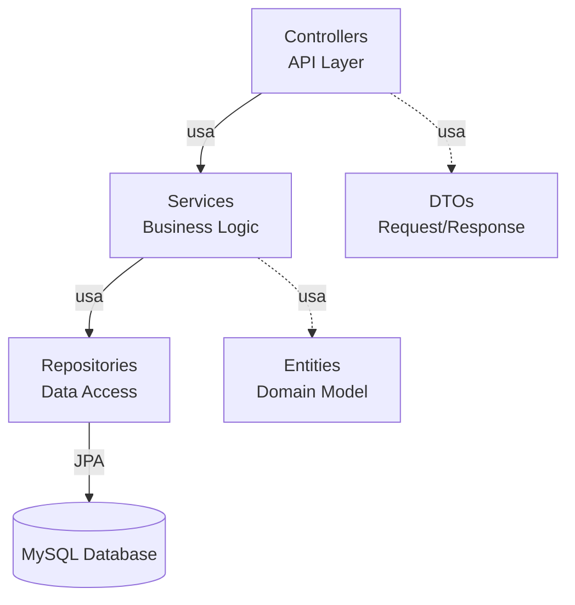
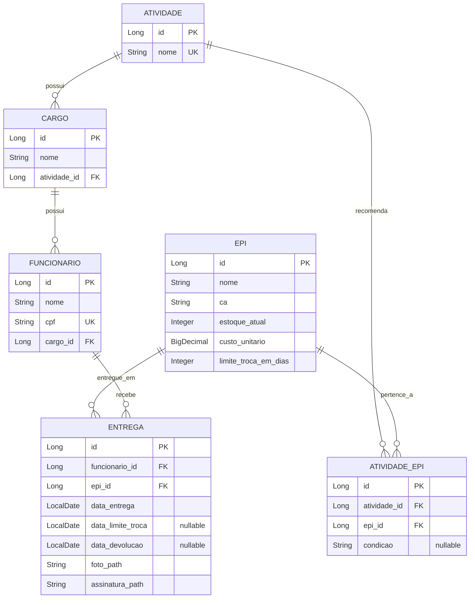

# Relatório de Análise de Arquitetura - EPI Manager Backend

**Data**: 23 de Novembro de 2025  
**Versão**: 0.0.1-SNAPSHOT  
**Stack**: Spring Boot 4.0.0 | Java 21 | MySQL 8.0

---

## 📊 Visão Geral

### Estatísticas do Projeto
- **Linhas de Código**: ~700 LOC (src/main/java)
- **Arquivos Java**: 22
- **Entidades**: 6
- **Repositories**: 6
- **Services**: 4 (inclui 2 utilitários)
- **Controllers**: 3
- **DTOs**: 1
- **Testes**: 6

### Estrutura de Pacotes
```
com.thoni.epimanager/
├── config/          (1 arquivo)  - Configuração e seeding
├── controller/      (3 arquivos) - API REST
├── dto/             (1 arquivo)  - Data Transfer Objects
├── entity/          (6 arquivos) - Modelo de domínio
├── repository/      (6 arquivos) - Camada de persistência
└── service/         (4 arquivos) - Lógica de negócio
```

---

## 🏗️ Arquitetura

### Padrão Arquitetural
**Layered Architecture** (Arquitetura em Camadas), seguindo Spring Boot best practices:



### Princípios Aplicados
✅ **Separation of Concerns** - Camadas bem definidas  
✅ **Dependency Injection** - Constructor injection via Spring  
✅ **Repository Pattern** - Spring Data JPA  
✅ **DTO Pattern** - Parcial (apenas EntregaRequest)  
⚠️ **Service Layer Pattern** - Implementado, mas com lógica simplificada

---

## 💾 Modelo de Dados

### Diagrama Entidade-Relacionamento



### Análise das Entidades

#### ✅ **Pontos Fortes**
1. **Normalização Adequada**: Separação de `Atividade` e `Cargo` permite flexibilidade
2. **Tabela Associativa**: `AtividadeEpi` implementa corretamente relação N:N com atributo extra (`condicao`)
3. **Rastreabilidade**: `Entrega` registra foto, assinatura e datas importantes
4. **Integridade Referencial**: Uso correto de `@ManyToOne`, `@JoinColumn`, `nullable=false`

#### ⚠️ **Pontos de Atenção**
1. **Lombok Overuse**: `@Data` gera equals/hashCode que podem causar problemas com proxies JPA
2. **Falta de Auditoria**: Sem campos `createdAt`, `updatedAt`, `createdBy`
3. **Soft Delete Ausente**: Não há suporte para exclusão lógica
4. **Validações Limitadas**: Faltam validações de negócio (ex: CPF válido, CA obrigatório)

---

## 🔧 Camada de Serviço

### Services Implementados

| Service | Responsabilidade | Métodos | Complexidade |
|---------|------------------|---------|--------------|
| `EpiService` | Gestão de EPIs | 3 | Baixa |
| `EntregaService` | Registro de entregas | 2 | Média |
| `DataDiagnosticService` | Análise de dados | 5 | Média |
| `DataNormalizationService` | Limpeza de dados | 2 | Baixa |

### Análise de EpiService

**Método destaque**: `findRecomendadosPorCargo()`
```java
public List<Epi> findRecomendadosPorCargo(Long cargoId) {
    Cargo cargo = cargoRepository.findById(cargoId)
            .orElseThrow(() -> new RuntimeException("Cargo não encontrado"));
    
    List<AtividadeEpi> atividadeEpis = atividadeEpiRepository
            .findByAtividadeId(cargo.getAtividade().getId());
    
    return atividadeEpis.stream()
            .map(AtividadeEpi::getEpi)
            .collect(Collectors.toList());
}
```

✅ **Bom**: Lógica de negócio correta (recomenda EPIs por atividade do cargo)  
⚠️ **Problema**: N+1 query problem potencial (sem `@EntityGraph`)  
⚠️ **Problema**: Exceções genéricas (`RuntimeException`)

### Análise de EntregaService

**Transação Complexa**: `registrarEntrega()`
```java
@Transactional
public Entrega registrarEntrega(...) {
    // 1. Busca e valida Funcionário
    // 2. Busca e valida EPI
    // 3. Valida estoque
    // 4. Decrementa estoque
    // 5. Cria registro de entrega
    // 6. Calcula data limite de troca
    // 7. Salva entrega
}
```

✅ **Bom**: Uso correto de `@Transactional`  
✅ **Bom**: Validação de estoque antes de entrega  
✅ **Bom**: Cálculo automático de `dataLimiteTroca`  
⚠️ **Problema**: Ausência de rollback explícito em caso de erro  
⚠️ **Problema**: Paths de arquivos não são validados

---

## 🌐 Camada de API

### Endpoints Disponíveis

#### **Funcionários**
- `GET /funcionarios` - Lista todos
- `POST /funcionarios` - Cria novo
- `GET /funcionarios/{id}` - Busca por ID

#### **EPIs**
- `GET /epis` - Lista todos
- `POST /epis` - Cria novo
- `GET /epis/recomendados?cargoId={id}` - Lista recomendados

#### **Entregas**
- `POST /entregas` - Registra entrega
- `GET /entregas/vencendo?dias={n}` - Notificações (padrão: 7 dias)

### Análise dos Controllers

✅ **Pontos Fortes**:
- Uso consistente de `@RestController` e `@RequestMapping`
- Injeção de dependências via construtor
- Uso de DTOs em `EntregaController`
- Códigos HTTP adequados (`@ResponseStatus(CREATED)`)

⚠️ **Pontos de Melhoria**:
1. **Falta de Exception Handling Global**: Sem `@ControllerAdvice`
2. **Validação Inconsistente**: Apenas `Funcionario` usa `@Valid`
3. **Sem Paginação**: Endpoints `GET /funcionarios` e `GET /epis` podem retornar muitos dados
4. **Ausência de HATEOAS**: Links de navegação não implementados
5. **Sem Versionamento**: API sem estratégia de versionamento (`/v1/...`)

---

## ✅ Testes

### Cobertura Atual

| Camada | Arquivos | Status |
|--------|----------|--------|
| Services | 4/4 | 100% |
| Controllers | 0/3 | 0% |
| Repositories | 0/6 | 0% |

### Testes Existentes

**EntregaServiceTest** (4 testes)
- ✅ Cálculo de data limite de troca
- ✅ Listagem de vencimentos próximos
- ✅ Validação de estoque zerado
- ✅ Funcionário não encontrado

**EpiServiceTest** (3 testes)
- ✅ Listar todos EPIs
- ✅ Recomendações por cargo
- ✅ Cargo não encontrado

**Testes Utilitários** (2 classes)
- `DataDiagnosticTest` - Valida análise de dados
- `DataNormalizationTest` - Valida normalização

### Gaps de Cobertura

⚠️ **Faltam testes para**:
- Controllers (integração / end-to-end)
- Repositories (custom queries)
- Validações de entidades
- Casos de erro (rollback de transações)

---

## 🔐 Segurança

### Estado Atual
❌ **Sem Autenticação/Autorização** - Todos os endpoints são públicos  
❌ **Sem Spring Security**  
❌ **Sem Rate Limiting**  
❌ **Sem Validação de Input** completa (SQL Injection, XSS)  
❌ **Sem CORS configurado** explicitamente  
❌ **Senhas/Credenciais**: Não há gestão de usuários ainda

### Recomendações Críticas
1. Implementar Spring Security com JWT
2. Adicionar validação de CPF (evitar dados inválidos)
3. Sanitizar inputs (especialmente paths de arquivos)
4. Configurar CORS para produção

---

## ⚡ Performance

### Potenciais Problemas

1. **N+1 Query Problem** em `EpiService.findRecomendadosPorCargo()`
   ```java
   // Atualmente: 1 query Cargo + 1 query Atividade + 1 query AtividadeEpi + N queries Epi
   // Solução: @EntityGraph ou fetch join
   ```

2. **Lazy Loading sem Controle**
   - Relacionamentos `@ManyToOne` sem especificação de fetch strategy
   - Pode causar `LazyInitializationException` fora de transações

3. **Sem Cache**
   - EPIs são dados relativamente estáticos, ideais para cache
   - Atividades e Cargos também poderiam ser cacheados

4. **Sem Índices Customizados**
   - Apenas índices automáticos (PKs e UKs)
   - Falta índice em `AtividadeEpi.atividade_id` para queries frequentes

### Otimizações Sugeridas

```java
// Adicionar fetch join para evitar N+1
@Query("SELECT ae FROM AtividadeEpi ae JOIN FETCH ae.epi WHERE ae.atividade.id = :atividadeId")
List<AtividadeEpi> findByAtividadeIdWithEpi(@Param("atividadeId") Long atividadeId);

// Adicionar cache em EPIs
@Cacheable("epis")
public List<Epi> findAll() { ... }
```

---

## 📁 Configuração e Infraestrutura

### DatabaseSeeder

✅ **Pontos Fortes**:
- Parser Markdown para estrutura hierárquica (Atividades → Cargos → EPIs)
- Integração com CSV para `limiteTrocaEmDias`
- Execução automática no startup (`@Component` + `CommandLineRunner`)
- Transacional (`@Transactional`)

⚠️ **Pontos de Atenção**:
- `ddl-auto=create` **PERIGOSO** em produção (destrói dados)
- Sem controle de versão de migrations (Flyway/Liquibase ausente)
- Parsing manual de arquivos (frágil a mudanças de formato)

### application.properties

```properties
spring.jpa.hibernate.ddl-auto=create  # ⚠️ CRÍTICO: mudar para 'validate' em prod
spring.jpa.show-sql=true             # ⚠️ Desabilitar em produção
```

---

## 🎯 Resumo Executivo

### Maturidade da Arquitetura: **6/10**

| Aspecto | Nota | Justificativa |
|---------|------|---------------|
| Estrutura | 8/10 | Camadas bem definidas, padrões Spring |
| Modelo de Dados | 7/10 | Normalizado, mas falta auditoria |
| Lógica de Negócio | 6/10 | Funcional, mas com gaps (exceções, validações) |
| API Design | 5/10 | RESTful básico, sem paginação/versioning |
| Testes | 5/10 | Services cobertos, controllers não |
| Segurança | 2/10 | Praticamente ausente |
| Performance | 6/10 | Funcional, mas com N+1 queries |
| Manutenibilidade | 7/10 | Código limpo, mas sem docs |

---

## 🚀 Recomendações Prioritárias

### 🔴 **Alta Prioridade** (Antes de Produção)

1. **Segurança**
   - [ ] Implementar Spring Security + JWT
   - [ ] Adicionar `@PreAuthorize` nos endpoints
   - [ ] Validar e sanitizar inputs

2. **Configuração**
   - [ ] Mudar `ddl-auto` para `validate`
   - [ ] Implementar Flyway para migrations
   - [ ] Configurar profiles (dev/prod)

3. **Exception Handling**
   - [ ] Criar `@ControllerAdvice` global
   - [ ] Substituir `RuntimeException` por exceções customizadas
   - [ ] Retornar respostas padronizadas (Problem Details)

### 🟡 **Média Prioridade** (Melhorias de Qualidade)

4. **Testes**
   - [ ] Adicionar testes de controllers (`@WebMvcTest`)
   - [ ] Testes de integração (`@SpringBootTest`)
   - [ ] Implementar cobertura mínima de 70%

5. **Performance**
   - [ ] Resolver N+1 queries com `@EntityGraph`
   - [ ] Adicionar cache em EPIs (`@Cacheable`)
   - [ ] Implementar paginação em listagens

6. **API Design**
   - [ ] Adicionar paginação (`Pageable`)
   - [ ] Implementar versionamento (`/api/v1`)
   - [ ] Documentar com OpenAPI/Swagger

### 🟢 **Baixa Prioridade** (Futuras Melhorias)

7. **Auditoria**
   - [ ] Adicionar `@CreatedDate`, `@LastModifiedDate` (Spring Data Auditing)
   - [ ] Implementar soft delete

8. **Observabilidade**
   - [ ] Adicionar Spring Actuator
   - [ ] Configurar logging estruturado (Logback/SLF4J)
   - [ ] Métricas com Micrometer/Prometheus

9. **Arquitetura**
   - [ ] Considerar Event-Driven para notificações de vencimento
   - [ ] Separar módulos por bounded contexts (DDD)

---

## 📚 Referências Técnicas

- **Spring Boot**: 4.0.0
- **Java**: 21 (LTS)
- **Banco de Dados**: MySQL 8.0.44
- **Build Tool**: Maven
- **Padrões**: REST, Repository Pattern, Layered Architecture

---

**Conclusão**: O backend está **funcional e bem estruturado** para MVP, mas requer melhorias significativas em **segurança, testes e performance** antes de deployment em produção. A arquitetura é sólida e permite evolução incremental.
