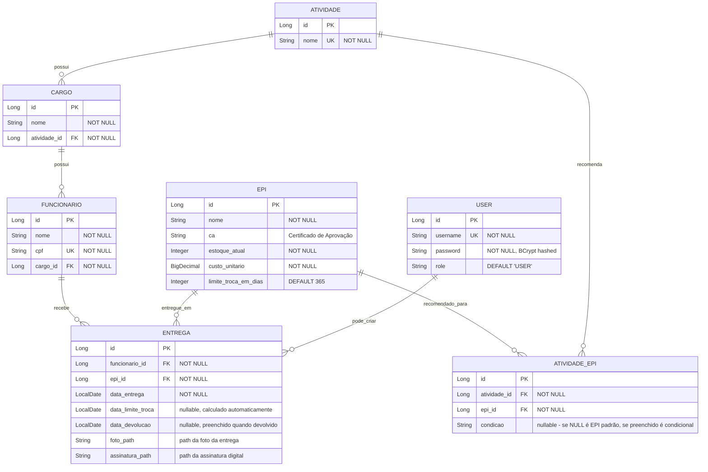
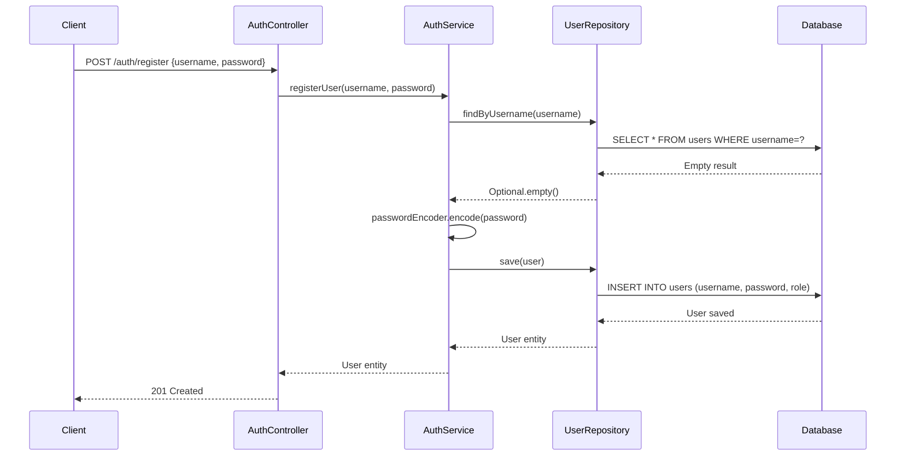
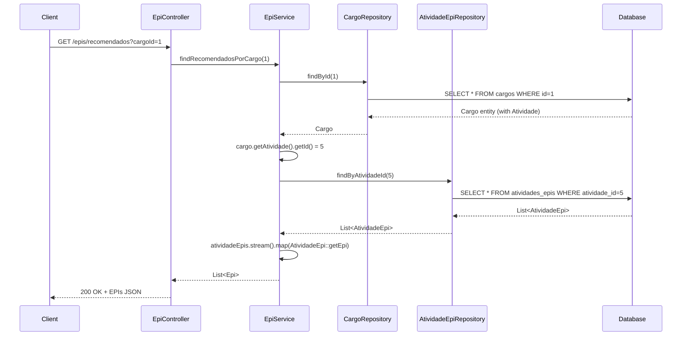
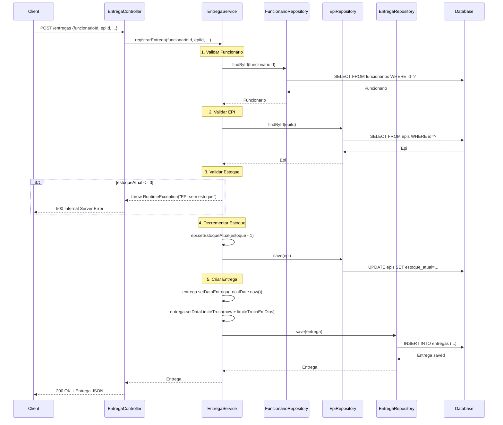
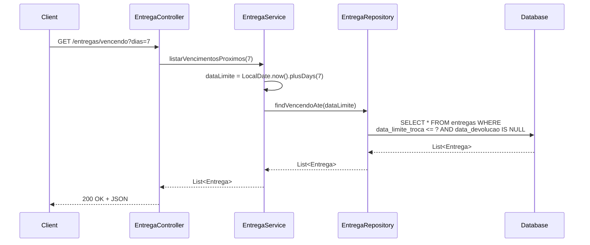

# EPI Manager Backend - Documentação Técnica Completa

**Versão**: 0.0.1-SNAPSHOT  
**Última Atualização**: 30 de Novembro de 2025  
**Status**: MVP com Autenticação Básica Implementada

---

## 📋 Índice

1. [Visão Geral](#visão-geral)
2. [Arquitetura](#arquitetura)
3. [Modelo de Dados](#modelo-de-dados)
4. [Endpoints da API](#endpoints-da-api)
5. [Autenticação e Segurança](#autenticação-e-segurança)
6. [Fluxos de Negócio](#fluxos-de-negócio)
7. [Estrutura de Código](#estrutura-de-código)
8. [Configuração e Dependências](#configuração-e-dependências)
9. [Testes](#testes)
10. [Guia para LLMs](#guia-para-llms)

---

## 📊 Visão Geral

### Propósito
Sistema backend para gerenciamento de EPIs (Equipamentos de Proteção Individual) em ambientes corporativos, focado em:
- Controle de estoque de EPIs
- Registro de entregas a funcionários
- Rastreamento de validade/limite de troca
- Recomendação de EPIs baseada em cargo/atividade
- Autenticação de usuários

### Stack Tecnológica
- **Framework**: Spring Boot 4.0.0
- **Linguagem**: Java 21 (LTS)
- **Banco de Dados**: MySQL 8.0
- **Build**: Maven
- **Segurança**: Spring Security com BCrypt
- **ORM**: Hibernate/JPA
- **Testes**: JUnit 5 + Mockito

### Estatísticas do Projeto
```
Arquivos Java (src/main):  30 arquivos | ~1038 linhas
Arquivos de Teste:         6 arquivos
Entidades:                 7 (User, Atividade, Cargo, Epi, AtividadeEpi, Funcionario, Entrega)
Repositories:              7 (Spring Data JPA)
Services:                  5 (AuthService, EpiService, EntregaService, DataDiagnosticService, DataNormalizationService)
Controllers:               4 (AuthController, EpiController, FuncionarioController, EntregaController)
DTOs:                      4 (RegisterRequest, LoginRequest, AuthResponse, EntregaRequest)
Endpoints API:             11 (2 públicos, 9 protegidos)
```

---

## 🏗️ Arquitetura

### Padrão Arquitetural
**Arquitetura em Camadas (Layered Architecture)** seguindo padrões Spring Boot MVC:

```
┌─────────────────────────────────────────┐
│          CLIENT (Postman/Android)        │
└──────────────┬──────────────────────────┘
               │ HTTP/REST
               ▼
┌─────────────────────────────────────────┐
│     CONTROLLERS (API Layer)              │
│  - AuthController                        │
│  - FuncionarioController                 │
│  - EpiController                         │
│  - EntregaController                     │
└──────────────┬──────────────────────────┘
               │
               ▼
┌─────────────────────────────────────────┐
│     SERVICES (Business Logic)            │
│  - AuthService (UserDetailsService)      │
│  - EpiService                            │
│  - EntregaService                        │
│  - DataDiagnosticService (utility)       │
│  - DataNormalizationService (utility)    │
└──────────────┬──────────────────────────┘
               │
               ▼
┌─────────────────────────────────────────┐
│    REPOSITORIES (Data Access)            │
│  - Spring Data JPA Interfaces            │
│  - Custom Queries (JPQL)                 │
└──────────────┬──────────────────────────┘
               │ JPA/Hibernate
               ▼
┌─────────────────────────────────────────┐
│        DATABASE (MySQL 8.0)              │
│  - 7 tabelas principais                  │
└─────────────────────────────────────────┘
```

### Camadas e Responsabilidades

#### 1. **Controllers** (Camada de Apresentação)
- Recebe requisições HTTP
- Valida entrada básica
- Chama services apropriados
- Retorna ResponseEntity com status HTTP corretos
- **Restrição**: Não contém lógica de negócio

#### 2. **Services** (Camada de Negócio)
- Implementa regras de negócio
- Coordena operações entre repositories
- Gerencia transações (@Transactional)
- Valida consistência de dados
- **Restrição**: Não conhece detalhes HTTP

#### 3. **Repositories** (Camada de Persistência)
- Abstração de acesso a dados via Spring Data JPA
- Queries customizadas quando necessário
- **Restrição**: Apenas operações CRUD + queries

#### 4. **Entities** (Modelo de Domínio)
- POJOs anotados com JPA
- Mapeamento objeto-relacional
- Validações de constraints (@NotBlank, @Column unique, etc.)

---

## 💾 Modelo de Dados

### Diagrama Entidade-Relacionamento



### Descrição Detalhada das Entidades

#### **User** (Autenticação)
- **Propósito**: Usuários do sistema (administradores, operadores)
- **Relacionamentos**: Nenhum direto (pode ser expandido no futuro)
- **Campos Importantes**:
  - `password`: Armazenado com BCrypt (nunca em plain text)
  - `role`: Preparado para controle de acesso (atualmente não utilizado)

#### **Atividade** (Contexto de Trabalho)
- **Propósito**: Representa atividades laborais (ex: "Florestal", "Construção Civil")
- **Relacionamentos**: 1:N com Cargo, N:M com Epi (via AtividadeEpi)
- **Unicidade**: Nome é unique constraint
- **Exemplo**: "ATIVIDADES DE APOIO RURAL", "FLORESTAL"

#### **Cargo** (Função do Funcionário)
- **Propósito**: Funções específicas dentro de uma atividade
- **Relacionamentos**: N:1 com Atividade, 1:N com Funcionario
- **Exemplo**: "OPERADOR DE MOTOSSERAS" (dentro de "FLORESTAL")

#### **Epi** (Equipamento de Proteção Individual)
- **Propósito**: Catálogo de EPIs disponíveis
- **Campos Importantes**:
  - `ca`: Certificado de Aprovação (obrigatório por lei brasileira)
  - `estoqueAtual`: Controlado automaticamente (decrementado em entregas)
  - `limiteTrocaEmDias`: Define validade do EPI (ex: 180 dias = 6 meses)
- **Exemplo**: "Botina de segurança" (CA: 00000, limite: 360 dias)

#### **AtividadeEpi** (Tabela Associativa)
- **Propósito**: Mapeia quais EPIs são recomendados para cada atividade
- **Campo Especial `condicao`**:
  - `NULL`: EPI é obrigatório sempre
  - `"Ruído"`: EPI obrigatório apenas se exposto a ruído
  - `"Poeiras"`: EPI obrigatório apenas se exposto a poeiras
- **Lógica**: Permite EPIs condicionais baseados em riscos

#### **Funcionario** (Trabalhador)
- **Propósito**: Cadastro de funcionários que recebem EPIs
- **Campos Importantes**:
  - `cpf`: Unique constraint (identificação única no Brasil)
  - `cargoId`: Determina quais EPIs são recomendados
- **Exemplo**: "João da Silva" (CPF: 123.456.789-00, Cargo: OPERADOR DE MOTOSSERAS)

#### **Entrega** (Registro de Fornecimento)
- **Propósito**: Rastreia entregas de EPIs a funcionários
- **Fluxo de Vida**:
  1. Criada com `dataEntrega = hoje`
  2. `dataLimiteTroca` calculada automaticamente (`dataEntrega + Epi.limiteTrocaEmDias`)
  3. `dataDevolucao` preenchida quando EPI é devolvido/trocado
- **Campos de Rastreamento**:
  - `fotoPath`: Evidência fotográfica da entrega
  - `assinaturaPath`: Assinatura digital do funcionário

---

## 🌐 Endpoints da API

### Resumo

| Endpoint | Método | Acesso | Descrição |
|----------|--------|--------|-----------|
| `/auth/register` | POST | 🌍 Público | Registra novo usuário |
| `/auth/login` | POST | 🌍 Público | Autentica usuário |
| `/funcionarios` | GET | 🔒 Autenticado | Lista todos funcionários |
| `/funcionarios` | POST | 🔒 Autenticado | Cria funcionário |
| `/funcionarios/{id}` | GET | 🔒 Autenticado | Busca funcionário por ID |
| `/epis` | GET | 🔒 Autenticado | Lista todos EPIs |
| `/epis` | POST | 🔒 Autenticado | Cria novo EPI |
| `/epis/recomendados?cargoId={id}` | GET | 🔒 Autenticado | EPIs recomendados para cargo |
| `/entregas` | POST | 🔒 Autenticado | Registra entrega de EPI |
| `/entregas/vencendo?dias={n}` | GET | 🔒 Autenticado | EPIs próximos do vencimento |

### Detalhamento por Módulo

#### 🔐 **Autenticação** (`AuthController`)

##### POST `/auth/register`
```json
Request Body:
{
  "username": "admin",
  "password": "admin123"
}

Success Response (201 Created):
"Usuário criado com sucesso: admin"

Error Response (400):
"Usuário já existe"
```

##### POST `/auth/login`
```json
Request Body:
{
  "username": "admin",
  "password": "admin123"
}

Success Response (200):
{
  "token": "BASIC_admin_1732394567890",
  "username": "admin"
}

Error Response (401):
"Unauthorized"
```

**Nota**: Token retornado é apenas informativo. Autenticação é via HTTP Basic Auth.

#### 👤 **Funcionários** (`FuncionarioController`)

##### GET `/funcionarios`
```json
Response (200):
[
  {
    "id": 1,
    "nome": "João da Silva",
    "cpf": "123.456.789-00",
    "cargo": {
      "id": 1,
      "nome": "TRABALHADOR RURAL POLIVALENTE",
      "atividade": {
        "id": 1,
        "nome": "ATIVIDADES DE APOIO RURAL"
      }
    }
  }
]
```

##### POST `/funcionarios`
```json
Request Body:
{
  "nome": "João da Silva",
  "cpf": "123.456.789-00",
  "cargo": {
    "id": 1
  }
}

Response (201):
{
  "id": 1,
  "nome": "João da Silva",
  ...
}
```

#### 🛡️ **EPIs** (`EpiController`)

##### GET `/epis`
```json
Response (200):
[
  {
    "id": 1,
    "nome": "Botina de segurança",
    "ca": "00000",
    "estoqueAtual": 10,
    "custoUnitario": 150.00,
    "limiteTrocaEmDias": 360
  }
]
```

##### GET `/epis/recomendados?cargoId=1`
```json
Response (200):
[
  {
    "id": 1,
    "nome": "Boné Árabe",
    "ca": "00000",
    ...
  },
  {
    "id": 2,
    "nome": "Óculos de proteção",
    "ca": "00000",
    ...
  }
]
```

**Lógica**: Busca Cargo → Pega Atividade → Retorna EPIs da AtividadeEpi

#### 📦 **Entregas** (`EntregaController`)

##### POST `/entregas`
```json
Request Body:
{
  "funcionarioId": 1,
  "epiId": 5,
  "fotoPath": "/storage/fotos/entrega_001.jpg",
  "assinaturaPath": "/storage/assinaturas/assinatura_001.png"
}

Response (200):
{
  "id": 1,
  "funcionario": {...},
  "epi": {...},
  "dataEntrega": "2025-11-30",
  "dataLimiteTroca": "2026-11-25",  // Calculado automaticamente
  "dataDevolucao": null,
  "fotoPath": "/storage/fotos/entrega_001.jpg",
  "assinaturaPath": "/storage/assinaturas/assinatura_001.png"
}
```

**Validações Automáticas**:
1. Verifica se `estoqueAtual > 0`
2. Decrementa estoque (`estoqueAtual--`)
3. Calcula `dataLimiteTroca` baseado em `Epi.limiteTrocaEmDias`

##### GET `/entregas/vencendo?dias=7`
```json
Request Parameters:
- dias: número de dias à frente (default: 7)

Response (200):
[
  {
    "id": 1,
    "funcionario": {...},
    "epi": {...},
    "dataEntrega": "2025-05-30",
    "dataLimiteTroca": "2025-12-05",  // Dentro de 7 dias
    "dataDevolucao": null
  }
]
```

**Query**: Retorna entregas onde `dataLimiteTroca <= (hoje + N dias)` E `dataDevolucao IS NULL`

---

## 🔐 Autenticação e Segurança

### Estratégia Implementada

**HTTP Basic Authentication** (temporário para MVP)

#### Configuração (`SecurityConfig.java`)
```java
@Configuration
@EnableWebSecurity
public class SecurityConfig {
    @Bean
    public SecurityFilterChain securityFilterChain(HttpSecurity http) {
        http
            .csrf(csrf -> csrf.disable())  // API REST, sem CSRF
            .authorizeHttpRequests(auth -> auth
                .requestMatchers("/auth/**").permitAll()  // Público
                .anyRequest().authenticated()              // Protegido
            )
            .sessionManagement(session -> session
                .sessionCreationPolicy(SessionCreationPolicy.STATELESS)  // Sem sessão
            )
            .httpBasic(basic -> {});  // Basic Auth ativo
        
        return http.build();
    }
}
```

#### Fluxo de Autenticação

```
1. REGISTRO
   Client → POST /auth/register {"username", "password"}
   Backend → BCrypt.hash(password)
   Backend → Save to DB
   Response ← 201 Created

2. LOGIN
   Client → POST /auth/login {"username", "password"}
   Backend → Validate credentials
   Backend → Generate token (informativo apenas)
   Response ← {"token", "username"}

3. ACESSO PROTEGIDO
   Client → GET /funcionarios
           Header: Authorization: Basic base64(admin:admin123)
   Backend → Spring Security valida
   Backend → UserDetailsService.loadUserByUsername()
   Backend → Compara BCrypt hashes
   Response ← 200 OK (se válido) ou 401 Unauthorized
```

### Segurança de Senha

**BCrypt** (Algoritmo de Hashing)
- Função: `BCryptPasswordEncoder`
- Rounds: 10 (padrão)
- Exemplo: 
  ```
  Plain: "admin123"
  Hashed: "$2a$10$N9qo8uLOickgx2ZMRZoMyeIjZAgcfl7p92ldGxad68LJZdL17lhWy"
  ```
- **Nunca** armazena senha em plain text

### UserDetailsService

```java
@Service
public class AuthService implements UserDetailsService {
    @Override
    public UserDetails loadUserByUsername(String username) {
        User user = userRepository.findByUsername(username)
            .orElseThrow(() -> new UsernameNotFoundException("..."));
        
        return new org.springframework.security.core.userdetails.User(
            user.getUsername(),
            user.getPassword(),  // BCrypt hash
            new ArrayList<>()     // Authorities (não utilizado no MVP)
        );
    }
}
```

### Limitações Atuais (MVP)

⚠️ **Não implementado**:
- JWT tokens (token retornado é apenas string simples)
- Refresh tokens
- Controle de permissões granulares (roles/authorities)
- Rate limiting
- CORS configuração explícita
- HTTPS enforcement

✅ **Suficiente para**:
- MVP interno
- Desenvolvimento Android
- Testes locais

🔴 **Antes de Produção, implementar**:
- JWT real (stateless, expira)
- HTTPS obrigatório
- Role-based access control

---

## 🔄 Fluxos de Negócio

### Fluxo 1: Registro de Novo Usuário



### Fluxo 2: Recomendação de EPIs por Cargo



### Fluxo 3: Registro de Entrega (com Validações)



### Fluxo 4: Listagem de Vencimentos Próximos



---

## 📁 Estrutura de Código

### Organização de Pacotes

```
src/main/java/com/thoni/epimanager/
├── EpimanagerApplication.java          (Main class)
├── config/
│   ├── DatabaseSeeder.java             (Carga inicial de dados)
│   └── SecurityConfig.java             (Spring Security config)
├── controller/
│   ├── AuthController.java             (2 endpoints: register, login)
│   ├── EpiController.java              (3 endpoints: create, list, recomendados)
│   ├── FuncionarioController.java      (3 endpoints: create, list, getById)
│   └── EntregaController.java          (2 endpoints: register, vencendo)
├── dto/
│   ├── AuthResponse.java               (Record: token, username)
│   ├── LoginRequest.java               (Record: username, password)
│   ├── RegisterRequest.java            (Record: username, password)
│   └── EntregaRequest.java             (Record: funcionarioId, epiId, ...)
├── entity/
│   ├── User.java                       (Auth user)
│   ├── Atividade.java                  (Business domain)
│   ├── Cargo.java                      (Business domain)
│   ├── Epi.java                        (Business domain)
│   ├── AtividadeEpi.java               (Join table)
│   ├── Funcionario.java                (Business domain)
│   └── Entrega.java                    (Business domain)
├── repository/
│   ├── UserRepository.java             (findByUsername)
│   ├── AtividadeRepository.java        (findByNome)
│   ├── CargoRepository.java            (JPA default)
│   ├── EpiRepository.java              (findByNome)
│   ├── AtividadeEpiRepository.java     (findByAtividadeId)
│   ├── FuncionarioRepository.java      (findByCpf)
│   └── EntregaRepository.java          (findVencendoAte - custom JPQL)
└── service/
    ├── AuthService.java                (UserDetailsService impl)
    ├── EpiService.java                 (Business logic for EPIs)
    ├── EntregaService.java             (Business logic for deliveries)
    ├── DataDiagnosticService.java      (Utility: data quality checks)
    └── DataNormalizationService.java   (Utility: data cleanup)
```

### Convenções de Código

1. **Nomenclatura PT-BR**: Todas entidades, campos e métodos em português
2. **Records para DTOs**: Java Records para imutabilidade
3. **Lombok**: `@Data` em entities (gera getters/setters)
4. **Constructor Injection**: Services usam injeção via construtor
5. **JPQL Queries**: Queries customizadas via `@Query` annotation
6. **Transações**: `@Transactional` em operações que modificam múltiplas entidades

---

## ⚙️ Configuração e Dependências

### pom.xml (Principais Dependências)

```xml
<dependencies>
    <!-- Spring Boot Starters -->
    <dependency>
        <groupId>org.springframework.boot</groupId>
        <artifactId>spring-boot-starter-web</artifactId>
    </dependency>
    <dependency>
        <groupId>org.springframework.boot</groupId>
        <artifactId>spring-boot-starter-data-jpa</artifactId>
    </dependency>
    <dependency>
        <groupId>org.springframework.boot</groupId>
        <artifactId>spring-boot-starter-security</artifactId>
    </dependency>
    <dependency>
        <groupId>org.springframework.boot</groupId>
        <artifactId>spring-boot-starter-validation</artifactId>
    </dependency>
    
    <!-- Database -->
    <dependency>
        <groupId>com.mysql</groupId>
        <artifactId>mysql-connector-j</artifactId>
        <scope>runtime</scope>
    </dependency>
    
    <!-- Dev Tools -->
    <dependency>
        <groupId>org.springframework.boot</groupId>
        <artifactId>spring-boot-devtools</artifactId>
        <optional>true</optional>
    </dependency>
    
    <!-- Utility -->
    <dependency>
        <groupId>org.projectlombok</groupId>
        <artifactId>lombok</artifactId>
        <optional>true</optional>
    </dependency>
</dependencies>
```

### application.properties

```properties
# Application
spring.application.name=epimanager

# Database
spring.datasource.url=jdbc:mysql://localhost:3307/epimanager_db?allowPublicKeyRetrieval=true&useSSL=false
spring.datasource.username=root
spring.datasource.password=root
spring.datasource.driver-class-name=com.mysql.cj.jdbc.Driver

# JPA/Hibernate
spring.jpa.hibernate.ddl-auto=create  # ⚠️ DANGER: drops tables on restart
spring.jpa.show-sql=true              # ⚠️ Logs SQL (disable in prod)
spring.jpa.properties.hibernate.format_sql=true
spring.jpa.properties.hibernate.dialect=org.hibernate.dialect.MySQLDialect
```

### Schema do Banco (Gerado Automaticamente)

7 tabelas criadas via Hibernate DDL:
1. `users` (autenticação)
2. `atividades` (contexto de trabalho)
3. `cargos` (funções)
4. `epis` (equipamentos)
5. `atividades_epis` (recomendações)
6. `funcionarios` (trabalhadores)
7. `entregas` (registros)

**Constraints**:
- Foreign keys: `ON DELETE` behavior padrão (RESTRICT)
- Unique constraints: `username` (users), `nome` (atividades), `cpf` (funcionarios)
- Not nulls: Todos FKs e campos obrigatórios

---

## ✅ Testes

### Cobertura Atual

| Camada | Arquivos | Cobertura |
|--------|----------|-----------|
| Services | 3/5 | 60% |
| Controllers | 0/4 | 0% |
| Repositories | 0/7 | 0% |
| **Total** | **3/16** | **~19%** |

### Testes Implementados

#### `EpiServiceTest.java` (3 testes)
```java
@SpringBootTest
class EpiServiceTest {
    @Test
    void deveListarTodosEpis() {...}
    
    @Test
    void deveRecomendarEpisPorCargo() {...}
    
    @Test
    void deveLancarExcecaoQuandoCargoNaoEncontrado() {...}
}
```

#### `EntregaServiceTest.java` (4 testes)
```java
@SpringBootTest
class EntregaServiceTest {
    @Test
    void deveRegistrarEntregaComSucesso() {...}
    
    @Test
    void deveCalcularDataLimiteTrocaCorretamente() {...}
    
    @Test
    void deveLancarExcecaoQuandoEstoqueZerado() {...}
    
    @Test
    void deveListarVencimentosProximos() {...}
}
```

#### Testes Utilitários
- `DataDiagnosticTest.java`: Valida análise de qualidade de dados
- `DataNormalizationTest.java`: Valida normalização de condições
- `NormalizationVerificationTest.java`: Teste integrado de normalização

### Gaps de Teste

❌ **Não testado**:
- Controllers (integração/end-to-end)
- Repositories (custom queries)
- AuthService (autenticação)
- DatabaseSeeder
- Validações de entities

---

## 🤖 Guia para LLMs

### Como Interpretar Este Backend

#### Quando Adicionar Nova Funcionalidade

1. **Entidade Nova**: 
   - Criar em `entity/` com annotations JPA
   - Adicionar Repository em `repository/`
   - Verificar relacionamentos (FK)

2. **Endpoint Novo**:
   - Criar/modificar Controller
   - Implementar lógica no Service
   - Adicionar DTO se necessário
   - Atualizar Postman collection

3. **Query Customizada**:
   - Adicionar `@Query` no Repository
   - Ou criar método seguindo naming convention Spring Data

#### Padrões a Seguir

```java
// ✅ BOM: Controller delega para Service
@PostMapping("/epis")
public ResponseEntity<Epi> create(@RequestBody Epi epi) {
    return ResponseEntity.status(HttpStatus.CREATED)
        .body(epiService.save(epi));
}

// ❌ RUIM: Lógica no Controller
@PostMapping("/entregas")
public Entrega create(@RequestBody EntregaRequest req) {
    Funcionario f = funcionarioRepository.findById(req.funcionarioId()).get();
    Epi e = epiRepository.findById(req.epiId()).get();
    // ... lógica aqui = ERRADO
}
```

```java
// ✅ BOM: Service com @Transactional
@Service
public class EntregaService {
    @Transactional
    public Entrega registrarEntrega(...) {
        // Múltiplas operações no banco
        // Se uma falhar, rollback automático
    }
}

// ❌ RUIM: Sem transação em operações múltiplas
public Entrega registrarEntrega(...) {
    epiRepository.save(epi);      // Sucesso
    entregaRepository.save(ent);  // Falha
    // Estoque foi decrementado mas entrega não foi criada!
}
```

#### Palavras-Chave (Conceitos Importantes)

- **Atividade**: Contexto de trabalho amplo
- **Cargo**: Função específica dentro de uma Atividade
- **AtividadeEpi**: Recomendações de EPIs (com condições)
- **Limite de Troca**: Validade do EPI em dias
- **Data Entrega**: Quando foi entregue
- **Data Limite Troca**: Quando deve ser trocado (calculado)
- **Data Devolução**: Quando foi devolvido (nullable)
- **Condicao**: Risco que justifica uso do EPI (nullable se sempre obrigatório)

#### Estrutura de Resposta JSON Típica

**Funcionario Completo** (com relacionamentos):
```json
{
  "id": 1,
  "nome": "João",
  "cpf": "123.456.789-00",
  "cargo": {
    "id": 5,
    "nome": "OPERADOR",
    "atividade": {
      "id": 2,
      "nome": "FLORESTAL"
    }
  }
}
```

**Entrega Completa**:
```json
{
  "id": 1,
  "dataEntrega": "2025-11-30",
  "dataLimiteTroca": "2026-11-25",
  "dataDevolucao": null,
  "fotoPath": "/storage/foto.jpg",
  "assinaturaPath": "/storage/assinatura.png",
  "funcionario": {...},  // nested
  "epi": {...}           // nested
}
```

#### Como Fazer Queries Complexas

```java
// Repository com Join Fetch (evita N+1 queries)
@Query("SELECT ae FROM AtividadeEpi ae " +
       "JOIN FETCH ae.epi " +
       "WHERE ae.atividade.id = :atividadeId")
List<AtividadeEpi> findByAtividadeIdWithEpi(@Param("atividadeId") Long id);

// Repository com filtros múltiplos
@Query("SELECT e FROM Entrega e " +
       "WHERE e.dataLimiteTroca <= :dataLimite " +
       "AND e.dataDevolucao IS NULL")
List<Entrega> findVencendoAte(@Param("dataLimite") LocalDate data);
```

#### Erros Comuns a Evitar

1. **N+1 Queries**: Usar `JOIN FETCH` quando acessar relacionamentos
2. **Lazy Loading fora de Transação**: Anotar métodos com `@Transactional(readOnly = true)`
3. **BCrypt em Loop**: Nunca chamar `passwordEncoder.encode()` em loop
4. **Exceções Genéricas**: Criar custom exceptions em vez de `RuntimeException`
5. **Sem Validação de Estoque**: Sempre verificar antes de entregar EPI

---

## 📌 Status e Próximos Passos

### ✅ Implementado (MVP Completo)

- [x] CRUD completo (Funcionários, EPIs, Entregas)
- [x] Autenticação básica (Spring Security + BCrypt)
- [x] Controle de estoque automático
- [x] Recomendação de EPIs por cargo
- [x] Cálculo de vencimento automático
- [x] Endpoints de notificação (/entregas/vencendo)
- [x] Data seeding (Markdown parser)
- [x] Testes unitários (Services)
- [x] Postman collection atualizado

### 🚧 Em Planejamento

**Dia 3 (Action Plan)**: 
- [ ] OpenAPI/Swagger documentation
- [ ] Validação aprofundada de inputs

**Futuro (Pós-MVP)**:
- [ ] JWT tokens reais
- [ ] Testes de controllers
- [ ] Exception handling global (@ControllerAdvice)
- [ ] Paginação em listagens
- [ ] Soft delete
- [ ] Auditoria (createdAt, updatedAt)

### 🎯 Foco Atual

**Backend**: Finalizar documentação → Passar para Android  
**Prazo Backend**: 30 de Novembro de 2025  
**Após**: Iniciar desenvolvimento Android (Kotlin)

---

## 📚 Referências Rápidas

### Comandos Úteis

```bash
# Compilar
./mvnw clean compile

# Rodar aplicação
./mvnw spring-boot:run

# Rodar testes
./mvnw test

# Rodar teste específico
./mvnw test -Dtest=EpiServiceTest
```

### URLs Importantes

- **API Base**: `http://localhost:8080`
- **Banco de Dados**: `localhost:3307/epimanager_db`
- **Postman Collection**: `/postman/epimanager_collection.json`

### Variáveis de Ambiente (Docker MySQL)

```yaml
MYSQL_ROOT_PASSWORD: root
MYSQL_DATABASE: epimanager_db
MYSQL_TCP_PORT: 3307
```

---

**Documento mantido por**: Sistema de IA  
**Formato**: Markdown para legibilidade humana e LLM  
**Versionamento**: Atualizar a cada mudança significativa na arquitetura
